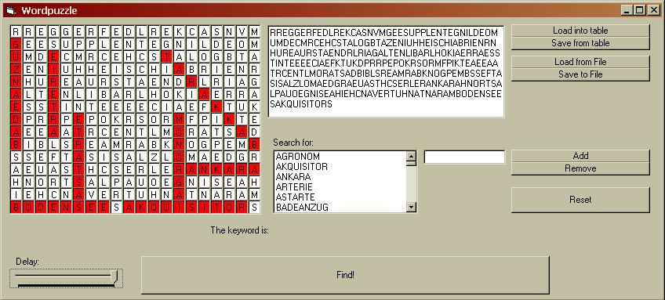



## Word Puzzle Solver

### Description

WordFindGame-Solver

This prgram is able to solve WordFinding Games.

The Problem:

o You have a 15x20 sheet filled with letters

o And you have a list of words you have to find in

o The unused letters are a keyword

(I've seen this game in a Magazine and wasn't able to solve it in an acceptable time, my PC

found out the key within one second)
 
### More Info
 

             |
---                |---
**Submitted On**   |2003-12-07 18:59:54
**By**             |[Cyber Chris](https://github.com/Planet-Source-Code/PSCIndex/blob/master/ByAuthor/cyber-chris.md)
**Level**          |Intermediate
**User Rating**    |5.0 (10 globes from 2 users)
**Compatibility**  |VB 3\.0, VB 4\.0 \(16\-bit\), VB 4\.0 \(32\-bit\), VB 5\.0, VB 6\.0
**Category**       |[Games](https://github.com/Planet-Source-Code/PSCIndex/blob/master/ByCategory/games__1-38.md)
**World**          |[Visual Basic](https://github.com/Planet-Source-Code/PSCIndex/blob/master/ByWorld/visual-basic.md)
**Archive File**   |[Word\_Puzzl1681771282003\.zip](https://github.com/Planet-Source-Code/cyber-chris-word-puzzle-solver__1-50374/archive/master.zip)

